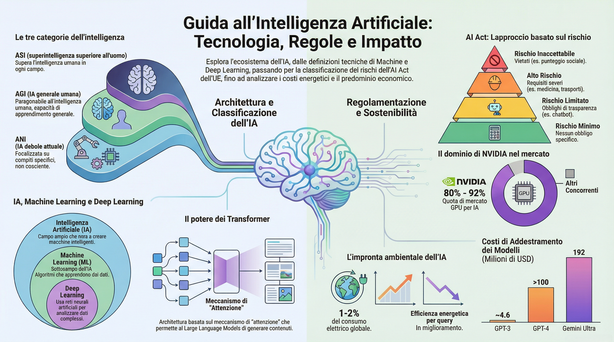
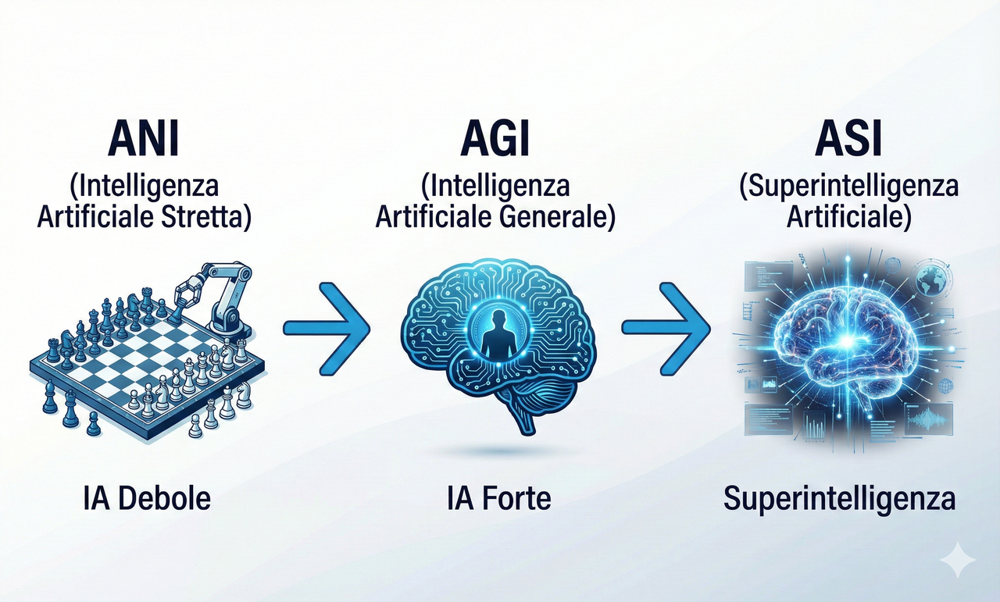
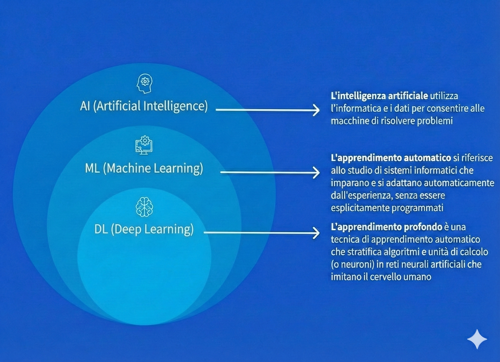
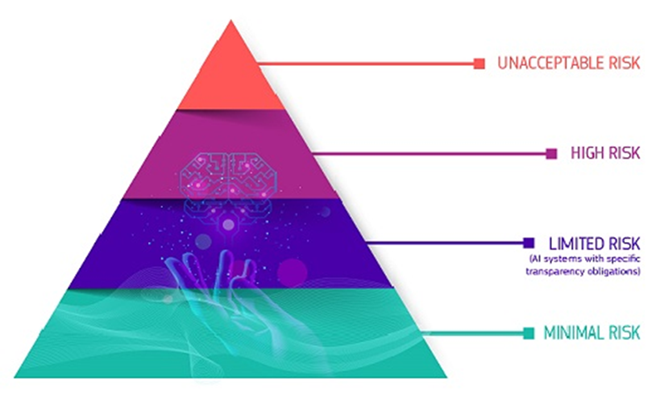
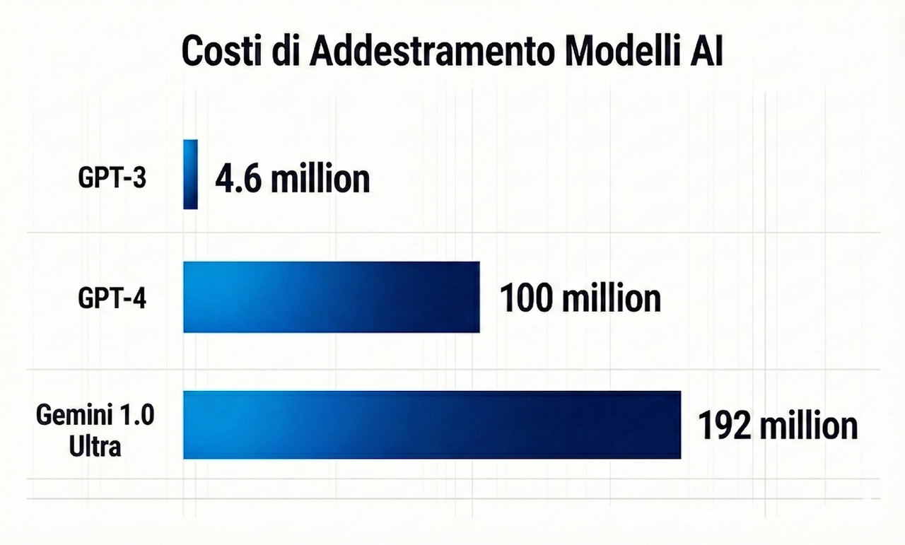
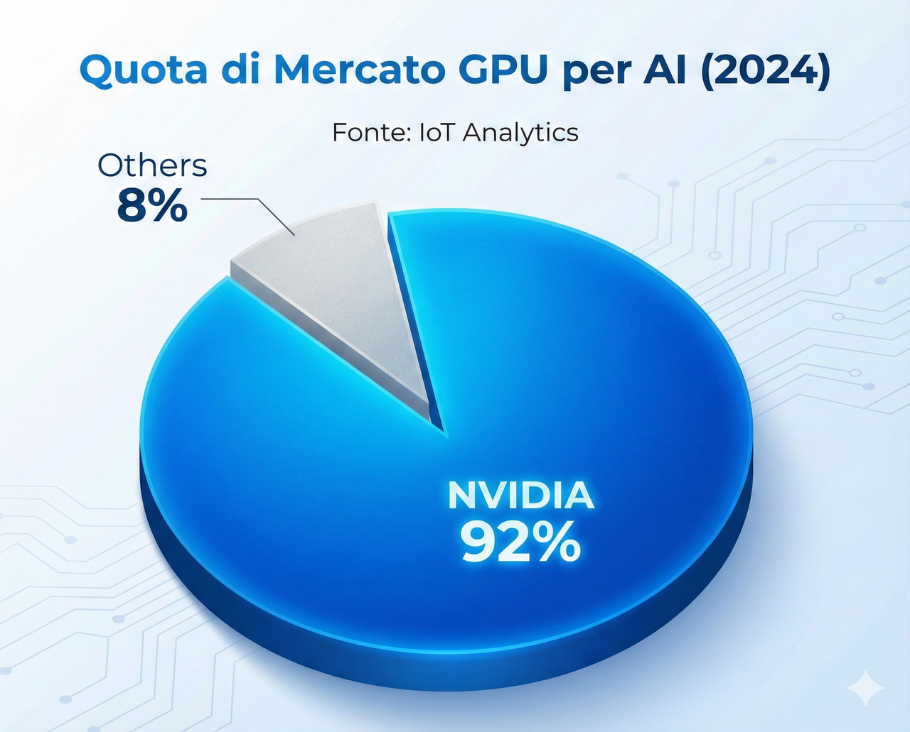

# Intelligenza Artificiale - concetti di base, aspetti sociali, economici e ambientali

- [Intelligenza Artificiale - concetti di base, aspetti sociali, economici e ambientali](#intelligenza-artificiale---concetti-di-base-aspetti-sociali-economici-e-ambientali)
  - [Che cosa si intende per Intelligenza Artificiale](#che-cosa-si-intende-per-intelligenza-artificiale)
  - [Le categorie dell'Intelligenza Artificiale](#le-categorie-dellintelligenza-artificiale)
  - [Machine Learning e Deep Learning](#machine-learning-e-deep-learning)
    - [Il Machine Learning: fondamenti e applicazioni](#il-machine-learning-fondamenti-e-applicazioni)
    - [Le tipologie di apprendimento automatico](#le-tipologie-di-apprendimento-automatico)
    - [Il Deep Learning e le reti neurali](#il-deep-learning-e-le-reti-neurali)
  - [L'Intelligenza Artificiale Generativa](#lintelligenza-artificiale-generativa)
    - [Definizione e caratteristiche](#definizione-e-caratteristiche)
    - [Architettura e funzionamento dei Large Language Models](#architettura-e-funzionamento-dei-large-language-models)
  - [Il quadro normativo: AI Act e Risoluzione ONU](#il-quadro-normativo-ai-act-e-risoluzione-onu)
    - [L'AI Act dell'Unione Europea](#lai-act-dellunione-europea)
      - [L'approccio basato sul rischio](#lapproccio-basato-sul-rischio)
      - [Tempistiche di attuazione](#tempistiche-di-attuazione)
      - [Sanzioni previste](#sanzioni-previste)
    - [La Risoluzione ONU sull'Intelligenza Artificiale](#la-risoluzione-onu-sullintelligenza-artificiale)
  - [Aspetti economici dell'Intelligenza Artificiale](#aspetti-economici-dellintelligenza-artificiale)
    - [I costi dell'AI generativa](#i-costi-dellai-generativa)
    - [Il mercato delle GPU e il predominio di NVIDIA](#il-mercato-delle-gpu-e-il-predominio-di-nvidia)
  - [I costi ambientali dell'Intelligenza Artificiale](#i-costi-ambientali-dellintelligenza-artificiale)
    - [Il consumo energetico dell'AI: dati e prospettive](#il-consumo-energetico-dellai-dati-e-prospettive)
    - [Training vs Inference: dove si consuma di più?](#training-vs-inference-dove-si-consuma-di-più)
    - [Il consumo idrico: una risorsa critica](#il-consumo-idrico-una-risorsa-critica)
    - [Fact-checking: l'AI è davvero "estremamente onerosa"?](#fact-checking-lai-è-davvero-estremamente-onerosa)
    - [Strategie di mitigazione e prospettive future](#strategie-di-mitigazione-e-prospettive-future)
  - [Impatto sociale e sul mondo del lavoro](#impatto-sociale-e-sul-mondo-del-lavoro)
    - [L'impatto globale sull'occupazione](#limpatto-globale-sulloccupazione)
    - [Opportunità e sfide per i lavoratori](#opportunità-e-sfide-per-i-lavoratori)
    - [Considerazioni etiche e responsabilità](#considerazioni-etiche-e-responsabilità)
  - [Conclusioni](#conclusioni)
  - [Riferimenti bibliografici](#riferimenti-bibliografici)

## Che cosa si intende per Intelligenza Artificiale

[Video introduttivo](https://youtu.be/4RixMPF4xis?si=k43umQQFWqTlV_Fa)

L'intelligenza artificiale (AI) rappresenta uno dei campi più rivoluzionari e trasformativi dell'informatica contemporanea. Nella sua accezione più ampia, il termine "intelligenza artificiale" viene utilizzato per classificare quelle macchine capaci di mimare l'intelligenza umana e le funzioni cognitive tipiche dell'essere umano, come il problem-solving e l'apprendimento. L'AI utilizza previsioni e automazione per ottimizzare e risolvere compiti complessi che storicamente erano eseguiti dall'uomo, tra cui il riconoscimento facciale e vocale, il processo decisionale e la traduzione automatica. Questa definizione, sebbene ampia, racchiude un insieme eterogeneo di tecnologie, metodologie e approcci che hanno come denominatore comune l'obiettivo di replicare, simulare o superare determinate capacità cognitive umane attraverso sistemi computazionali [^1].

L'evoluzione dell'informatica e la disponibilità di enormi quantità di dati (il cosiddetto "big data"), unitamente all'incremento esponenziale della capacità di calcolo dei processori, hanno reso possibile la transizione dell'AI da concetto teorico a realtà applicativa pervasiva. Oggi, i sistemi di intelligenza artificiale sono integrati in numerosi aspetti della vita quotidiana: dai sistemi di raccomandazione dei contenuti delle piattaforme di streaming agli assistenti vocali come Siri e Alexa, dai sistemi di navigazione GPS ai software di diagnosi medica. La proliferazione di queste tecnologie ha generato un dibattito acceso non solo sulle loro potenzialità, ma anche sulle implicazioni etiche, sociali ed economiche che derivano dalla loro adozione su larga scala.

## Le categorie dell'Intelligenza Artificiale

La comunità scientifica riconosce tre categorie principali di intelligenza artificiale, classificate in base al livello di complessità e alle capacità rispetto all'intelligenza umana. Questa tassonomia, sebbene soggetta a dibattito e revisione, fornisce un quadro concettuale utile per comprendere lo stato dell'arte e le prospettive future dello sviluppo dell'AI.

*Figura 1: Le tre categorie di Intelligenza Artificiale - ANI, AGI e ASI*

**Artificial Narrow Intelligence (ANI)**: Conosciuta anche come "AI debole" o "AI ristretta", rappresenta l'unica forma di intelligenza artificiale effettivamente realizzata fino a oggi. L'ANI è definita dalla sua capacità di completare un compito specifico e ben delimitato, come vincere una partita a scacchi, identificare un particolare individuo in una serie di fotografie o tradurre testo da una lingua all'altra. Il natural language processing (NLP) e la computer vision, che consentono alle aziende di automatizzare compiti e costituiscono la base di chatbot e assistenti virtuali come Siri e Alexa, sono esempi paradigmatici di ANI. La computer vision, in particolare, è un fattore cruciale nello sviluppo delle automobili a guida autonoma, dove l'abilità di riconoscere oggetti, pedoni e segnali stradali in tempo reale è fondamentale per la sicurezza.

**Artificial General Intelligence (AGI)**: Definita anche "AI forte" o "AI generale", questa forma di intelligenza artificiale ipotizzata sarebbe in grado di eseguire qualsiasi compito intellettuale che un essere umano può svolgere, raggiungendo un livello di prestazioni paragonabile a quello di un'altra persona. L'AGI implicherebbe la capacità di ragionare, pianificare, apprendere da esperienze limitate e trasferire conoscenze da un dominio all'altro. Al momento, l'AGI rimane un obiettivo teorico e di ricerca, con stime molto diverse sulle tempistiche per la sua eventuale realizzazione, che spaziano da pochi decenni a secoli o addirittura all'impossibilità pratica.

**Artificial Super Intelligence (ASI)**: Conosciuta anche come "superintelligenza" rappresenterebbe una forma di AI capace di superare l'intelligenza e le abilità umane in tutti i domini cognitivi. Un'ASI non solo eguaglierebbe le capacità umane, ma le eccellerebbe sistematicamente, dalla creatività all'intelligenza emotiva, dalla capacità di pianificazione strategica alla risoluzione di problemi scientifici complessi. Le discussioni sull'ASI coinvolgono questioni filosofiche profonde riguardanti la coscienza, la volontà e la natura stessa dell'intelligenza, e sollevano importanti interrogativi circa la governance e il controllo di entità potenzialmente più intelligenti dell'uomo.

La distinzione tra AI debole e AI forte non è meramente accademica, ma ha implicazioni pratiche significative per la comprensione delle tecnologie attuali e per la regolamentazione dei sistemi di AI. Mentre l'ANI è già ampiamente diffusa e oggetto di normative specifiche, le forme più avanzate di AI pongono sfide concettuali e pratiche che richiedono un approccio precauzionale e un'attenta riflessione etica.

## Machine Learning e Deep Learning

### Il Machine Learning: fondamenti e applicazioni

[Video introduttivo](https://youtu.be/9gGnTQTYNaE?si=gLI3FpR7UqRGWo62)

Il Machine Learning (ML), traducibile come "apprendimento automatico", rappresenta un sottoinsieme dell'intelligenza artificiale dedicato allo sviluppo di algoritmi e tecniche che consentono ai computer di apprendere dai dati senza essere esplicitamente programmati per ogni singolo compito. Quando configurato correttamente, il machine learning aiuta a effettuare previsioni che minimizzano gli errori derivanti da semplici congetture, rendendo i sistemi capaci di migliorare progressivamente le proprie prestazioni attraverso l'esperienza. Un esempio paradigmatico è rappresentato dalle aziende come Amazon, che utilizzano il machine learning per raccomandare prodotti a specifici clienti sulla base delle loro precedenti visualizzazioni e acquisti.

*Figura 2: La gerarchia tra Intelligenza Artificiale, Machine Learning e Deep Learning*

Il diagramma sopra illustra chiaramente la relazione gerarchica tra questi concetti: l'Intelligenza Artificiale è il campo più ampio, che include tutti i metodi per far "pensare" alle macchine; il Machine Learning è un sottocampo dell'IA, che si concentra su sistemi che imparano dai dati senza programmazione esplicita; il Deep Learning è un sottocampo del Machine Learning, che usa reti neurali profonde per apprendere rappresentazioni complesse dei dati [^2].

### Le tipologie di apprendimento automatico

Il machine learning si articola in diverse tipologie di apprendimento, ciascuna caratterizzata da specifiche metodologie e campi di applicazione. La comprensione di queste distinzioni è fondamentale per apprezzare le potenzialità e i limiti delle diverse tecnologie di AI.

*Figura 3: Le quattro principali tipologie di apprendimento automatico*

**Apprendimento supervisionato (Supervised Learning)**: Questa metodologia prevede l'utilizzo di dataset etichettati per istruire l'algoritmo. Ad esempio, se si mostrano immagini di diversi tipi di cibo rapido etichettate come "pizza", "hamburger" e "taco", un esperto umano determina le caratteristiche distintive di ciascuna immagine. Il pane in ciascun tipo di alimento potrebbe costituire una caratteristica distintiva, oppure potrebbero essere utilizzate etichette per semplificare il processo di apprendimento. L'algoritmo apprende così a mappare gli input agli output desiderati, potendo successivamente generalizzare a nuovi dati non etichettati.

**Apprendimento non supervisionato (Unsupervised Learning)**: In questo approccio, l'algoritmo lavora con dati non etichettati e deve scoprire autonomamente pattern e strutture nascoste. Il sistema raggruppa i dati in base a similarità intrinseche, senza alcuna indicazione pregressa su cosa cercare. Questa metodologia è particolarmente utile per l'analisi esplorativa dei dati, la rilevazione di anomalie e la segmentazione di clienti in contesti commerciali.

**Apprendimento per rinforzo (Reinforcement Learning)**: Una terza categoria di machine learning è rappresentata dall'apprendimento per rinforzo, dove un computer apprende interagendo con l'ambiente circostante e ricevendo feedback (premi o penalità) per le proprie azioni. Questo approccio, ispirato alla psicologia comportamentale, ha ottenuto risultati spettacolari in giochi complessi come Go e scacchi, e trova applicazione in robotica, sistemi di controllo e ottimizzazione di processi.

**Apprendimento online (Online Learning)**: Si tratta di una tipologia di ML dove un data scientist aggiorna il modello man mano che nuovi dati diventano disponibili. Questo approccio è particolarmente utile in contesti dove i dati fluiscono continuamente e dove è necessario adattarsi rapidamente a cambiamenti nelle distribuzioni dei dati, come nei mercati finanziari o nei sistemi di raccomandazione in tempo reale.

### Il Deep Learning e le reti neurali

[Video introduttivo](https://youtu.be/q6kJ71tEYqM?si=g2rPfG6EmZij_Q4G)

Il Deep Learning (DL), traducibile come "apprendimento profondo", rappresenta un sottoinsieme del machine learning che ha rivoluzionato il campo dell'intelligenza artificiale negli ultimi decenni. A differenza del machine learning classico, il deep learning può sfruttare dataset etichettati per informare il proprio algoritmo nell'apprendimento supervisionato, ma non necessariamente richiede un dataset etichettato. È in grado di assimilare dati non strutturati nella loro forma grezza (come testo e immagini) e può determinare automaticamente l'insieme di caratteristiche che distinguono, ad esempio, una "pizza" da un "hamburger" o un "taco".

Le reti neurali artificiali costituiscono l'architettura computazionale alla base del deep learning. Ispirate alla struttura del cervello umano, le reti neurali sono composte da strati (layer) di nodi interconnessi, ciascuno dei quali elabora informazioni e le trasmette agli strati successivi. Una rete neurale profonda (deep neural network) è caratterizzata da molteplici strati nascosti tra lo strato di input e quello di output, consentendo l'apprendimento di rappresentazioni gerarchiche sempre più astratte dei dati. Man mano che si generano sempre più big data, gli scienziati dei dati faranno sempre maggiore uso del machine learning e, in particolare, del deep learning.

## L'Intelligenza Artificiale Generativa

### Definizione e caratteristiche

[Video introduttivo](https://youtu.be/hfIUstzHs9A?si=bZ3DrlLwNzJb9Uxx)

L'intelligenza artificiale generativa rappresenta una delle evoluzioni più significative nel panorama dell'AI, distinguendosi dalla tradizionale AI discriminativa per la sua capacità di creare contenuti originali piuttosto che limitarsi a classificare o analizzare dati esistenti. I sistemi di AI generativa sono progettati per generare nuovi contenuti, tra cui testo, immagini, audio, video e codice informatico, che imitano le caratteristiche dei dati su cui il modello è stato addestrato. Questa capacità creativa, sebbene mediata da algoritmi e non da una vera ispirazione artistica, ha aperto orizzonti applicativi precedentemente inesplorati.

I Large Language Models (LLM), come GPT-4 di OpenAI, Claude di Anthropic e Gemini di Google, rappresentano l'espressione più nota dell'AI generativa nel dominio testuale. Questi modelli sono caratterizzati da un numero enorme di parametri (miliardi o addirittura trilioni), che vengono affinati durante il processo di addestramento attraverso l'esposizione a vasti corpus testuali. Il vero "segreto" dei LLM risiede proprio nei parametri, che vengono plasmati durante l'intensivo processo di training. L'addestramento comporta la "compressione" di una vasta quantità di dati testuali provenienti da internet: ad esempio, il modello LLaMA-2-70B ha utilizzato circa 10TB di testo estratto dal web e ha richiesto risorse computazionali significative, tra cui circa 6.000 GPU per 12 giorni, con un costo approssimativo di 2 milioni di dollari.

### Architettura e funzionamento dei Large Language Models

L'architettura alla base della maggior parte degli LLM contemporanei è il Transformer, introdotto nel 2017 da ricercatori di Google. Il meccanismo chiave del Transformer è l'attenzione (attention), che consente al modello di pesare l'importanza relativa delle diverse parti dell'input nella generazione di ciascun token dell'output. Questa architettura ha dimostrato una capacità eccezionale nel catturare dipendenze a lungo rango nel testo, superando le limitazioni delle architetture ricorrenti precedenti.

Il processo di addestramento può essere schematicamente rappresentato come una forma di compressione "lossy" (con perdita) dei dati: i 10TB di dati vengono ridotti a un file di parametri di circa 140GB, raggiungendo un rapporto di compressione di circa 100X. A differenza della compressione lossless (come un tipico file zip), questo processo comporta la perdita di alcune informazioni originali. I modelli all'avanguardia come GPT-4 sono circa dieci volte più impegnativi dal punto di vista computazionale rispetto a LLaMA-2-70B, riflettendo la corsa al dimensionamento che caratterizza il settore.

## Il quadro normativo: AI Act e Risoluzione ONU

### L'AI Act dell'Unione Europea

Il Regolamento sull'Intelligenza Artificiale (AI Act) rappresenta il primo quadro normativo completo a livello mondiale volto a regolamentare l'uso dell'intelligenza artificiale nell'Unione Europea. Questo regolamento, come si legge nel comunicato stampa ufficiale, mira a "proteggere i diritti fondamentali, la democrazia, lo Stato di diritto e la sostenibilità ambientale dai sistemi di AI ad alto rischio, promuovendo nel contempo l'innovazione e assicurando all'Europa un ruolo guida nel settore". L'AI Act è entrato in vigore il 2 agosto 2024, con un'attuazione graduale delle sue disposizioni [^3].

#### L'approccio basato sul rischio

L'AI Act adotta un approccio basato sul rischio, classificando i sistemi di intelligenza artificiale in quattro categorie principali in base al livello di rischio che presentano per la sicurezza, i diritti fondamentali e i valori dell'Unione Europea. La piramide seguente illustra visivamente questa classificazione:

*Figura 4: I quattro livelli di rischio secondo l'AI Act dell'Unione Europea*

**Rischio inaccettabile**: Tutti i sistemi di AI considerati una minaccia chiara per la sicurezza, i mezzi di sussistenza e i diritti delle persone sono vietati. Esempi includono: manipolazione e inganno basati sull'AI; sfruttamento delle vulnerabilità degli individui; valutazione del rischio individuale di reati o predizione; raccolta indiscriminata di dati per il riconoscimento facciale; riconoscimento delle emozioni in ambienti lavorativi ed educativi; identificazione biometrica remota in tempo reale per scopi di applicazione della legge in spazi pubblici.

**Alto rischio**: I sistemi ad alto rischio includono tecnologie AI utilizzate in: infrastrutture critiche (es. trasporti) che potrebbero mettere a rischio la vita e la salute dei cittadini; istruzione o formazione professionale che può determinare l'accesso all'istruzione; componenti di sicurezza di prodotti (es. applicazioni AI in chirurgia robot-assistita); impiego e gestione dei lavoratori; servizi privati e pubblici essenziali (es. sistemi di scoring creditizio); applicazione della legge che può interferire con i diritti fondamentali; migrazione, asilo e controllo delle frontiere; amministrazione della giustizia e processi democratici.

I sistemi di AI ad alto rischio sono soggetti a obblighi rigorosi prima di poter essere immessi sul mercato: adeguata valutazione e mitigazione dei rischi; alta qualità dei dataset che alimentano il sistema per minimizzare rischi e risultati discriminatori; registrazione delle attività per garantire la tracciabilità dei risultati; documentazione dettagliata che fornisca tutte le informazioni necessarie sul sistema e sul suo scopo; informazioni chiare e adeguate all'utilizzatore; appropriate misure di supervisione umana; elevato livello di robustezza, sicurezza e accuratezza.

**Rischio limitato**: Si riferisce ai rischi associati alla mancanza di trasparenza nell'uso dell'AI. L'AI Act introduce specifici obblighi di trasparenza per garantire che gli esseri umani siano informati quando necessario. Ad esempio, quando si utilizzano sistemi di AI come chatbot, le persone devono essere consapevoli di interagire con una macchina. I fornitori dovranno anche garantire che i contenuti generati dall'AI siano identificabili.

**Rischio minimo o nullo**: L'AI Act consente il libero uso di AI a rischio minimo, che include applicazioni come videogiochi abilitati all'AI o filtri antispam. La stragrande maggioranza dei sistemi di AI attualmente utilizzati nell'UE rientra in questa categoria.

#### Tempistiche di attuazione

L'AI Act prevede un'attuazione graduale delle sue disposizioni, con scadenze specifiche calcolate a partire dalla data di entrata in vigore del regolamento. I divieti di pratiche vietate sono applicabili entro 6 mesi dall'entrata in vigore; i codici di condotta devono essere implementati entro 9 mesi; le norme generali sull'AI, compresa la governance, entrano in vigore dopo 12 mesi; gli obblighi per i sistemi ad alto rischio saranno applicabili tra 24 e 36 mesi.

#### Sanzioni previste

Il regolamento stabilisce soglie di sanzione che gli Stati membri devono applicare: fino a 35 milioni di euro o al 7% del fatturato totale annuo a livello mondiale per le violazioni relative alle pratiche vietate o alla non conformità ai requisiti sui dati; fino a 15 milioni di euro o al 3% del fatturato per la mancata osservanza di altri requisiti; fino a 7,5 milioni di euro o all'1,5% del fatturato per la fornitura di informazioni inesatte o fuorvianti. Per ogni categoria di infrazione, la soglia è il minore dei due importi per le PMI e il maggiore per le altre aziende.

### La Risoluzione ONU sull'Intelligenza Artificiale

Il 21 marzo 2024, l'Assemblea Generale delle Nazioni Unite ha adottato all'unanimità una risoluzione storica sulla promozione di sistemi di intelligenza artificiale "sicuri, protetti e affidabili". La risoluzione, proposta dagli Stati Uniti e sostenuta da oltre 120 Nazioni, ha evidenziato il ruolo significativo che i sistemi di intelligenza artificiale possono svolgere nel progresso verso il conseguimento dei 17 obiettivi elencati nell'Agenda 2030 per lo Sviluppo Sostenibile [^4].

L'Assemblea ha esortato tutti gli Stati membri a evitare o interrompere l'impiego di sistemi di intelligenza artificiale che non siano conformi al diritto internazionale sui diritti umani o che comportino rischi ingiustificati per il pieno godimento di questi ultimi. La risoluzione sottolinea che i diritti garantiti alle persone nel mondo fisico devono essere preservati anche nell'ambito digitale, attraverso tutto il ciclo di vita dei sistemi di intelligenza artificiale. L'Assemblea ha sollecitato Stati, settore privato, società civile, istituzioni di ricerca e media a promuovere e implementare strategie e quadri normativi di governance che garantiscano l'utilizzo sicuro dell'intelligenza artificiale.

## Aspetti economici dell'Intelligenza Artificiale

### I costi dell'AI generativa

Il crescente numero di modelli di linguaggio di grandi dimensioni sul mercato offre notevoli capacità, ma dietro a tali modelli si celano costi sostanziali. La costruzione e l'addestramento di questi modelli sono estremamente costosi, richiedendo migliaia di unità di elaborazione grafica (GPU) per gestire i massicci set di dati da cui i modelli apprendono. Il grafico seguente confronta i costi di addestramento dei principali modelli AI:

*Figura 5: Confronto dei costi di addestramento dei principali modelli AI (in milioni di dollari)*

Come evidenziato dal grafico, i costi di addestramento sono cresciuti in modo esponenziale: mentre GPT-3 richiedeva circa 4,6 milioni di dollari, GPT-4 ha superato i 100 milioni e Gemini Ultra di Google ha raggiunto la cifra record di 192 milioni di dollari. Il solo costo delle GPU può ammontare a milioni di dollari: secondo una panoramica tecnica del modello linguistico GPT-3 di OpenAI, ogni sessione di addestramento richiedeva almeno 5 milioni di dollari di GPU.

I costi non si limitano all'addestramento: l'esecuzione di inferenze sui modelli, una volta addestrati, è parimenti costosa. Si stima che il costo di inferenza di GPT-4 sia proiettato a 2,3 miliardi di dollari nel 2024, circa 15 volte il suo costo di addestramento. Questo evidenzia come l'uso esclusivo di modelli massicci possa risultare insostenibile a lungo termine, con alcune stime che indicano che oltre il 99% delle operazioni computazionali potrebbe essere inutilizzato. Il crescente utilizzo di grandi modelli sta inoltre spingendo verso l'alto i prezzi dei data center, dove avviene la computazione.

### Il mercato delle GPU e il predominio di NVIDIA

NVIDIA detiene una posizione di assoluto predominio nel mercato dei chip AI, con una quota di mercato stimata tra l'80% e il 92% per le GPU utilizzate nell'addestramento e nel deployment di modelli di AI. Questa posizione dominante è in gran parte dovuta alla piattaforma software CUDA, che fornisce un ecosistema di sviluppo altamente ottimizzato per il calcolo parallelo su GPU NVIDIA. Il mercato dei chip AI è proiettato a raggiungere 564,87 miliardi di dollari entro il 2032, con una crescita annua composta del 15,7% dal 2025 al 2032.

*Figura 6: Quota di mercato di NVIDIA nel settore delle GPU per AI (2024)*

La posizione dominante di NVIDIA ha suscitato preoccupazioni riguardo al vendor lock-in, ovvero alla dipendenza tecnologica da un singolo fornitore. In risposta, un consorzio guidato da Intel, Google, Samsung, Qualcomm e ARM ha dato vita alla UXL Foundation (Unified Acceleration Foundation) con l'obiettivo di creare un'alternativa open source a CUDA. Il progetto si basa sullo standard oneAPI sviluppato da Intel, che mira a eliminare le dipendenze da specifici linguaggi di programmazione e strumenti proprietari, consentendo agli sviluppatori di scrivere codice che può essere eseguito su diverse architetture hardware.

## I costi ambientali dell'Intelligenza Artificiale

### Il consumo energetico dell'AI: dati e prospettive

L'impennata dello sviluppo e dell'adozione dei sistemi di intelligenza artificiale ha sollevato legittime preoccupazioni riguardo al loro impatto ambientale, in particolare per quanto attiene al consumo energetico e alle emissioni di gas serra. Secondo l'International Energy Agency (IEA), nel 2024 i data center hanno consumato circa 415 terawatt-ore (TWh) di elettricità, pari a circa l'1,5% del consumo elettrico globale. Questo dato, sebbene significativo, deve essere contestualizzato: rappresenta l'intero settore dei data center, non solo l'AI, e include tutti i servizi cloud, lo streaming video, i servizi di posta elettronica e le infrastrutture web [^5].

Le proiezioni dell'IEA indicano una crescita sostanziale: il consumo elettrico dei data center potrebbe superare i 1.000 TWh entro il 2030, con un tasso di crescita annuo del 15%, oltre quattro volte superiore alla crescita del consumo elettrico totale. Tuttavia, è fondamentale distinguere tra consumo energetico complessivo e impatto ambientale effettivo, poiché molti operatori di data center stanno investendo massicciamente in energia rinnovabile. Google, ad esempio, ha annunciato di aver ridotto le emissioni dei propri data center del 12% nel 2024 rispetto all'anno precedente, nonostante un incremento del 27% nel consumo elettrico, grazie a una maggiore quota di energia proveniente da fonti rinnovabili [^5][^13].

### Training vs Inference: dove si consuma di più?

Una distinzione cruciale spesso trascurata nel dibattito pubblico riguarda la differenza tra il consumo energetico necessario per l'addestramento (training) di un modello AI e quello richiesto per la sua successiva utilizzazione (inference). L'addestramento di modelli su larga scala come GPT-4 ha richiesto, secondo stime del MIT Technology Review, circa 50 gigawatt-ore di elettricità, con emissioni stimate tra 12.000 e 15.000 tonnellate di CO2 equivalente. Questi valori, pur essendo significativi, rappresentano un evento una tantum per ciascuna versione del modello [^7][^8].

L'inference, al contrario, ha un impatto cumulativo potenzialmente molto superiore a causa della scala globale dell'utilizzo. Tuttavia, ricerche recenti di Epoch AI hanno dimostrato che l'efficienza energetica per singola query è migliorata drasticamente: una query a ChatGPT che utilizza GPT-4o consuma circa 0,3 watt-ore, un valore dieci volte inferiore rispetto a stime precedenti relative a versioni meno ottimizzate. Secondo Google Cloud, l'impatto energetico medio per singolo prompt AI è equivalente a guardare la televisione per meno di nove secondi. Questo dato aiuta a contestualizzare le preoccupazioni circa l'"onerosità estrema" dell'AI in termini energetici: sebbene il volume complessivo delle query sia enorme, l'impatto unitario è contenuto e in progressiva riduzione [^9][^11].

### Il consumo idrico: una risorsa critica

Un aspetto dell'impatto ambientale dell'AI spesso sottovalutato riguarda il consumo idrico. I data center richiedono sistemi di raffreddamento che utilizzano ingenti quantità di acqua, principalmente attraverso sistemi di raffreddamento evaporativo. Uno studio pubblicato su ResearchGate ha stimato che l'addestramento di GPT-3 abbia consumato circa 700.000 litri di acqua dolce nei data center di Microsoft. Meta ha riportato un consumo indiretto di acqua di 72,2 miliardi di litri nel 2024, con una media di 3,92 litri per kWh di elettricità consumata. Questi dati evidenziano la necessità di sviluppare sistemi di raffreddamento più efficienti e di localizzare i data center in regioni con maggiore disponibilità idrica [^8].

### Fact-checking: l'AI è davvero "estremamente onerosa"?

L'affermazione secondo cui l'AI sarebbe "estremamente onerosa" in termini di risorse energetiche richiede un'analisi sfumata che consideri contesto, prospettive comparative e trend evolutivi. Il Fondo Monetario Internazionale (IMF) stima che l'insieme di data center e criptovalute costituisca circa il 2% del consumo elettrico globale e circa l'1% delle emissioni globali di gas serra. Questi valori sono significativi ma non catastrofici, e devono essere confrontati con quelli di altri settori: il solo mining di Bitcoin consuma circa 195 TWh annui, superiore ai 20-50 TWh stimati per l'addestramento di modelli AI [^12][^15].

Uno studio pubblicato su Nature nel 2025 ha confrontato le emissioni di gas serra generate dalla programmazione assistita da AI rispetto a quella umana, dimostrando che il modello più efficiente (GPT-4o-mini) produce emissioni comprese tra il 20% e il 59% rispetto a quelle generate da programmatori umani che utilizzano metodi tradizionali. Questo suggerisce che, in alcuni contesti, l'AI può effettivamente contribuire a ridurre l'impronta di carbonio complessiva delle attività umane, anziché aggravarla [^10].

Un ulteriore elemento di contesto riguarda l'efficienza dei data center moderni rispetto a infrastrutture IT distribuite. La concentrazione del calcolo computazionale in data center specializzati, dotati di sistemi di raffreddamento ottimizzati e alimentati da energie rinnovabili, può risultare complessivamente più efficiente rispetto alla frammentazione delle risorse informatiche in molteplici sedi locali. Microsoft ha contrattato 34 GW di nuova capacità di energia rinnovabile in 24 paesi, con l'obiettivo di operare tutti i propri data center al 100% con energia a zero emissioni di carbonio entro il 2030 [^14].

### Strategie di mitigazione e prospettive future

Il settore sta attivamente sviluppando strategie per ridurre l'impatto ambientale dell'AI. Le tecniche di ottimizzazione dei modelli, come la quantizzazione, il pruning e la distillazione, possono ridurre le dimensioni dei modelli e i costi di inferenza del 50-90% con perdite minime di accuratezza. La ricerca su architetture più efficienti, come i modelli sparsi e le reti neurali a bassa precisione, promette ulteriori miglioramenti. Parallelamente, l'adozione di metriche standardizzate per misurare l'impronta di carbonio dei modelli AI, come quelle proposte dal Carbon Footprint standard ISO 14067, sta aumentando la trasparenza e la comparabilità dei dati ambientali nel settore [^8][^15].

In conclusione, sebbene l'impatto ambientale dell'AI sia reale e meriti attenzione, la caratterizzazione di questa tecnologia come "estremamente onerosa" in termini energetici appare parzialmente fuorviante se priva di adeguata contestualizzazione. L'AI rappresenta circa l'1-2% del consumo elettrico globale, un valore inferiore a quello di molti altri settori industriali, e le principali aziende del settore stanno compiendo significativi investimenti in energie rinnovabili e tecnologie di efficienza energetica. La sfida principale non è tanto il consumo energetico attuale, quanto la traiettoria di crescita e la necessità di garantire che l'espansione dell'AI avvenga in modo sostenibile [^12][^13][^15].

## Impatto sociale e sul mondo del lavoro

### L'impatto globale sull'occupazione

Secondo un'analisi del Fondo Monetario Internazionale (IMF) pubblicata nel gennaio 2024, l'intelligenza artificiale interesserà quasi il 40% dei posti di lavoro in tutto il mondo, sostituendone alcuni e integrandone altri. L'impatto non sarà uniforme: nei paesi avanzati, fino al 60% dei posti di lavoro potrebbe essere esposto all'AI, mentre nei paesi in via di sviluppo questa percentuale scende al 40%. Questa disparità rischia di approfondire le disuguaglianze globali, poiché i paesi più sviluppati sono meglio posizionati per trarre beneficio dalle nuove tecnologie [^6].

L'IMF ha evidenziato che l'AI rappresenta "la nostra migliore possibilità di allentare i vincoli dal lato dell'offerta che hanno contribuito al rallentamento della crescita, alle nuove pressioni inflazionistiche, all'aumento dei costi del capitale". Tuttavia, è necessario un attento equilibrio di politiche per sfruttare le opportunità garantendo che i benefici siano distribuiti equamente. L'analisi sottolinea che i diritti garantiti alle persone devono essere preservati anche nell'ambito digitale, attraverso tutto il ciclo di vita dei sistemi di intelligenza artificiale [^6].

### Opportunità e sfide per i lavoratori

L'introduzione dell'AI nel mondo del lavoro presenta sia opportunità che sfide significative. Da un lato, l'automazione di compiti ripetitivi e routinari può liberare i lavoratori per attività più creative e strategiche, aumentando la produttività e la soddisfazione lavorativa. Dall'altro, la rapidità del cambiamento tecnologico rischia di rendere obsolete molte competenze professionali, richiedendo un impegno sostanziale in termini di riqualificazione e aggiornamento professionale. Le professioni che coinvolgono elaborazione di dati, traduzione, assistenza clienti e alcune forme di analisi sono tra quelle più esposte all'automazione.

Una sfida particolare è rappresentata dal potenziale impatto sull'equità e sull'inclusione sociale. Gli algoritmi di AI possono perpetuare o addirittura amplificare pregiudizi esistenti se addestrati su dati che riflettono discriminazioni storiche. Nei processi di assunzione, ad esempio, i sistemi di screening automatizzati hanno dimostrato in alcuni casi di favorire candidati di determinati gruppi demografici a discapito di altri. È pertanto essenziale che lo sviluppo e l'implementazione dei sistemi di AI siano accompagnati da rigorose valutazioni di impatto etico e sociale, come del resto previsto dall'AI Act europeo per i sistemi ad alto rischio [^3].

### Considerazioni etiche e responsabilità

Lo sviluppo e l'impiego dell'AI sollevano questioni etiche fondamentali che riguardano la trasparenza, la responsabilità, la privacy e l'autonomia umana. La natura spesso opaca ("black box") di molti algoritmi di deep learning rende difficile comprendere come un sistema abbia raggiunto una determinata decisione, con implicazioni significative in settori come la giustizia, la sanità e la finanza. La sfida della spiegabilità (explainability) è al centro di intense attività di ricerca, con l'obiettivo di rendere i sistemi di AI più trasparenti e comprensibili.

La questione della responsabilità è particolarmente complessa: quando un sistema di AI commette un errore o causa un danno, chi ne risponde? Il programmatore, l'azienda che ha sviluppato il sistema, l'utente che lo ha impiegato o il sistema stesso? I quadri normativi emergenti, come l'AI Act europeo, cercano di fornire risposte a questi interrogativi, stabilendo obblighi di supervisione umana e di documentazione che consentano di risalire alle cause dei malfunzionamenti. La protezione dei dati personali, già disciplinata dal GDPR, assume nuove dimensioni nel contesto dell'AI, dove la capacità di elaborare enormi quantità di dati può portare a inferenze e profilazioni che incidono sulla privacy degli individui in modi precedentemente impensabili.

## Conclusioni

L'intelligenza artificiale rappresenta una delle trasformazioni tecnologiche più significative del nostro tempo, con implicazioni che attraversano ogni ambito della società e dell'economia. Dai concetti fondamentali di AI debole e forte, attraverso le distinzioni tra machine learning e deep learning, fino alle frontiere dell'AI generativa, il percorso di comprensione di queste tecnologie è essenziale per chi si prepara a operare nel settore informatico. La conoscenza delle architetture, delle metodologie e dei limiti delle tecnologie di AI costituisce un prerequisito fondamentale per un loro impiego consapevole e responsabile.

Il quadro normativo in rapida evoluzione, con l'AI Act europeo che si configura come modello di riferimento a livello globale e la Risoluzione ONU che stabilisce principi universali per uno sviluppo etico dell'AI, richiede una costante attenzione da parte di sviluppatori, imprese e istituzioni [^3][^4]. Gli aspetti economici, dai costi ingenti di addestramento dei modelli al predominio di NVIDIA nel mercato delle GPU, delineano un panorama competitivo dinamico, con iniziative open source che cercano di promuovere un ecosistema più diversificato e accessibile.

Per i futuri professionisti dell'informatica, la sfida non è solo tecnica, ma anche etica, sociale e ambientale. La capacità di contribuire a uno sviluppo dell'AI che sia non solo tecnologicamente avanzato ma anche rispettoso dei diritti fondamentali, inclusivo e sostenibile, rappresenterà un fattore differenziante cruciale. L'educazione a un approccio critico e responsabile verso queste tecnologie, che ne comprenda potenzialità e rischi, è obiettivo centrale di questo modulo e rappresenta una competenza essenziale per i cittadini del XXI secolo.

## Riferimenti bibliografici

[^1]: IBM Think. "Artificial Intelligence: What is AI?" Disponibile presso: <https://www.ibm.com/think/artificial-intelligence>

[^2]: IBM Think. "AI vs. Machine Learning vs. Deep Learning vs. Neural Networks." Disponibile presso: <https://www.ibm.com/think/topics/ai-vs-machine-learning-vs-deep-learning-vs-neural-networks>

[^3]: European Commission. "Regulatory Framework for AI." Disponibile presso: <https://digital-strategy.ec.europa.eu/en/policies/regulatory-framework-ai>

[^4]: United Nations News. "General Assembly adopts landmark resolution on artificial intelligence." (21 marzo 2024). Disponibile presso: <https://news.un.org/en/story/2024/03/1147831>

[^5]: International Energy Agency (IEA). "Energy and AI" (2025). Disponibile presso: <https://www.iea.org/reports/energy-and-ai>

[^6]: IMF Blog. "AI Will Transform the Global Economy. Let's Make Sure It Benefits Humanity." (14 gennaio 2024). Disponibile presso: <https://www.imf.org/en/Blogs/Articles/2024/01/14/ai-will-transform-the-global-economy-lets-make-sure-it-benefits-humanity>

[^7]: MIT Technology Review. "We did the math on AI's energy footprint." (Maggio 2025). Disponibile presso: <https://www.technologyreview.com/2025/05/20/1116327/ai-energy-usage-climate-footprint-big-tech>

[^8]: MIT News. "Explained: Generative AI's environmental impact." (Gennaio 2025). Disponibile presso: <https://news.mit.edu/2025/explained-generative-ai-environmental-impact-0117>

[^9]: Epoch AI. "How much energy does ChatGPT use?" (2025). Disponibile presso: <https://epoch.ai/gradient-updates/how-much-energy-does-chatgpt-use>

[^10]: Nature. "A comparative study of AI and human programming on environmental impact" (2025). Disponibile presso: <https://www.nature.com/articles/s41598-025-24658-5>

[^11]: Google Cloud Blog. "Measuring the environmental impact of AI inference." (Agosto 2025). Disponibile presso: <https://cloud.google.com/blog/products/infrastructure/measuring-the-environmental-impact-of-ai-inference>

[^12]: IMF Blog. "Carbon Emissions from AI and Crypto Are Surging and Tax Policy Can Help." (Agosto 2024). Disponibile presso: <https://www.imf.org/en/blogs/articles/2024/08/15/carbon-emissions-from-ai-and-crypto-are-surging-and-tax-policy-can-help>

[^13]: Google Sustainability. "Sustainable & Efficient Operations" (2025). Disponibile presso: <https://sustainability.google/operations>

[^14]: Microsoft. "Environmental Sustainability Report 2025." Disponibile presso: <https://www.microsoft.com/en-us/corporate-responsibility/sustainability/report>

[^15]: Carbon Brief. "AI: Five charts that put data-centre energy use and emissions into context." (2025). Disponibile presso: <https://www.carbonbrief.org/ai-five-charts-that-put-data-centre-energy-use-and-emissions-into-context>